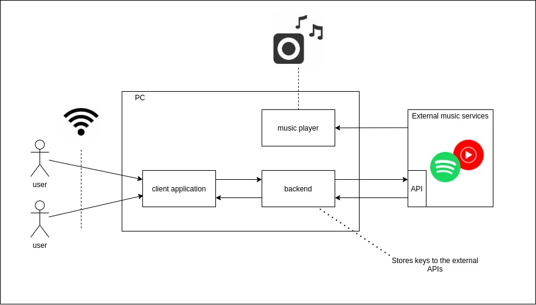

## __Music proxy__

### __Overview 🔎__

Main role of this project is to provide a access multi-access to music player running on local machine. As music players playing music from local files are passé, this project aims to solve this problem for streaming services.

### __Architecutre 🌐__

Architecture overview is presented on diagram below:



#### __System components__
- `client application` - simple frontend application accessible from local network
- `backend` - main component responsible for communication with external APIs and storing API keys


### __Requirements 🔧__
- docker
- docker-compose

### __Setup ⚙️__
#### __v1.0__
- configure application in spotify dashboard _// TODO add instruction_
- set client ID and client secret in `docker-compose.yaml`
- run
```
docker-compose up --build
```

### __Features 🚀__
- access by multiple users at the same time
- searching for song
- adding song to the play queue
- skipping currently playing songs

### __Roadmap 🚗__
#### __v1.0__
- __spotify client integration__
  - [ ] change authentication mode as some endpoints are using OAuth only
  - [ ] songs searching
  - [ ] adding songs to playing queue
  - [ ] skip currently playing song
  - [ ] support display of queued songs stored in local queue
